<div align="center">

# Blake Stone, recompiled

**Aliens of Gold** (1993) and **Planet Strike** (1994), JAM Productions / Apogee —
taken apart from their shipping DOS executables and rebuilt as native Windows programs.
No DOSBox. No emulator. The 1993 machine code, translated once and compiled for a
machine that did not exist when it shipped.

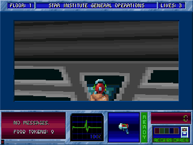

<sub>*Aliens of Gold*, Star Institute floor 1, running natively — a Sector Patrol guard
opens fire and the screen flashes red. Recorded headless with the built-in recorder.</sub>

</div>

---

## What it is

A static recompilation of both Blake Stone games. `tools/lift.py` unpacks each
game's executable, finds every function in it, and lifts the 16-bit x86 to C with
the [pcrecomp](https://github.com/sp00nznet/pcrecomp) toolkit; a small DOS machine
in `src/` answers the DOS, VGA, Sound Blaster, AdLib, keyboard and timer the game
expects. You supply the games; the build produces `bstone_aog.exe` and
`bstone_ps.exe`.

It is part of the pcrecomp family and follows its house style (repo rules,
section 10): the toolkit ships, the output never does.

## Status

**v0.1.0 — alpha. Both games boot, play, and pass their conformance runs.**

| | Aliens of Gold | Planet Strike |
|---|---|---|
| Version recompiled | 2.10R (registered; the Steam release) | V1.01 (the Steam release) |
| Functions lifted | 969 | 1003 |
| Intro, menus, briefings, story pages | ✅ | ✅ |
| Starting a mission, 3D view, HUD | ✅ | ✅ |
| Movement, combat, doors, pickups | ✅ | ✅ |
| AdLib music and FM effects (ymfm OPL2) | ✅ | ✅ |
| Sound Blaster digitized sound (DMA + IRQ) | ✅ | ✅ |
| PC speaker | modelled, untested | modelled, untested |
| Saving and loading | ✅ | ✅ |
| Windowed play (4:3, real time) | ✅ | ✅ |
| Mouse (raw input) | implemented, untested | implemented, untested |
| Gamepad (XInput, as keys) | implemented, untested | implemented, untested |
| Full playthrough | not yet | not yet |
| Hi-res 3D view (walls, floor, ceiling, sprites) | ✅ | ✅ |
| **Conformance** ([docs](docs/conformance.md)) | **22/22** | **17/17** |

Everything marked ✅ was seen working: in scripted headless runs, which the
conformance harness repeats, and the window on a virtual monitor. Nobody has
yet played either game end to end with hands on a keyboard, mouse or pad.
Treat this as an alpha: it will have bugs a full playthrough would find.

## The remaster: a hi-res, widescreen 3D view

In a window the 3D view is redrawn at 4× and widened to 16:9 (1704×800).
Walls, floor, ceiling, actors, objects and the weapon are drawn straight from
the game's own art at full resolution, with the game's own lighting, and
everything else is still the original code. The extra view at the sides is
cast by the game's own raycaster, turned left and right, with every byte put
back afterwards. **F10** cycles widescreen → original → hi-res 4:3;
`--hires N` sets the scale and `--widescreen 21:9` (or `off`) the shape. How it
works, and why it asks the original raycaster rather than replacing it:
[docs/renderer.md](docs/renderer.md).

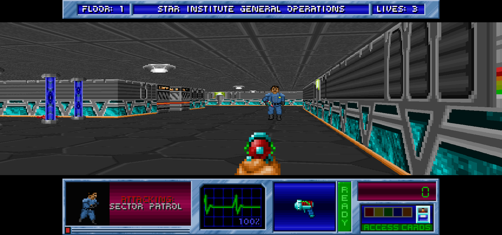

| *Aliens of Gold*: original · hi-res | *Planet Strike*: original · hi-res |
|---|---|
| 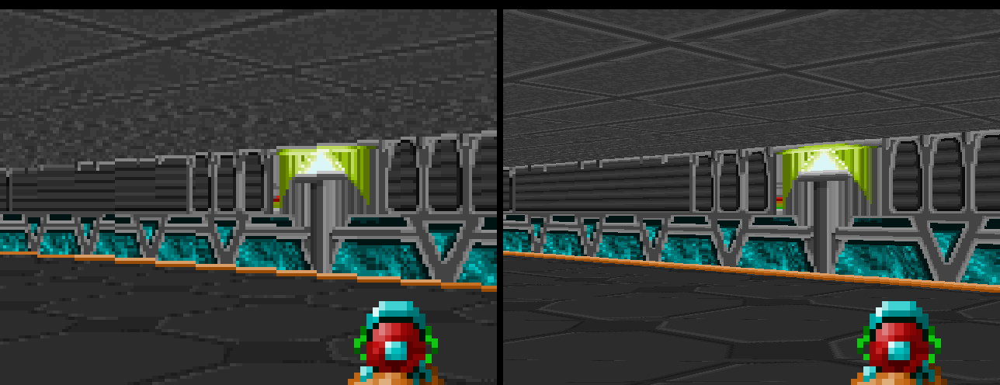 | 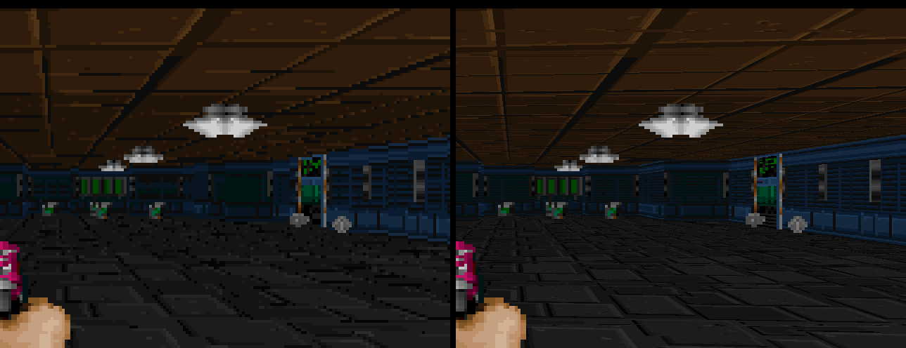 |

Also: three display modes (sharp 4:3, pixel-perfect, CRT scanlines — **F11**),
OPL2 music through ymfm, saves kept apart from the game install, an XInput pad,
and a built-in recorder.

## Screenshots

Every one of these is the recompiled game running.

| | |
|---|---|
| 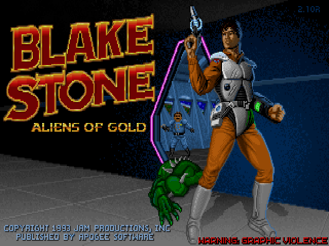 | 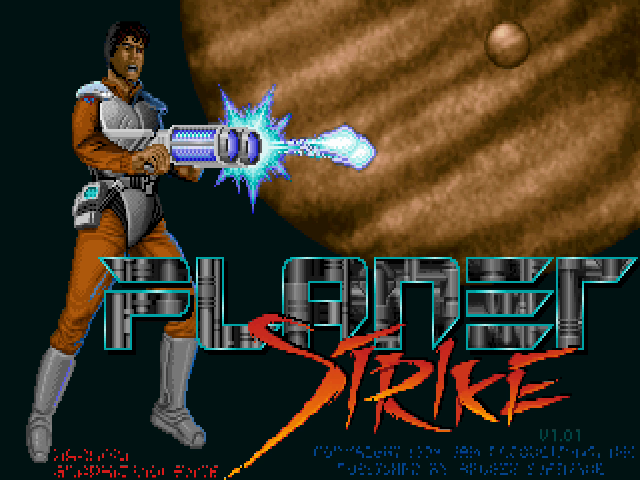 |
| *Aliens of Gold* title (v2.1) | *Planet Strike* title (V1.01) |
| 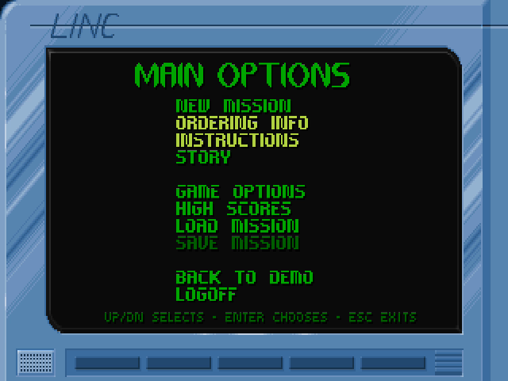 | 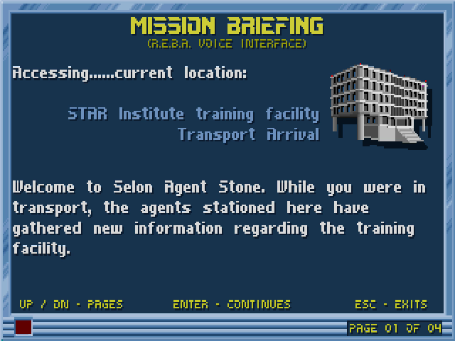 |
| The LINC terminal menus | "Welcome to Selon, Agent Stone." |
| 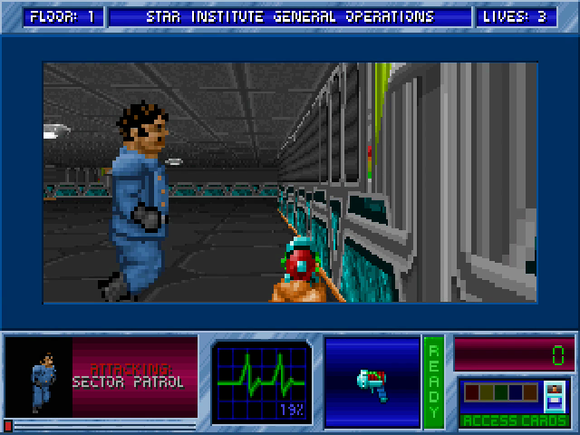 | 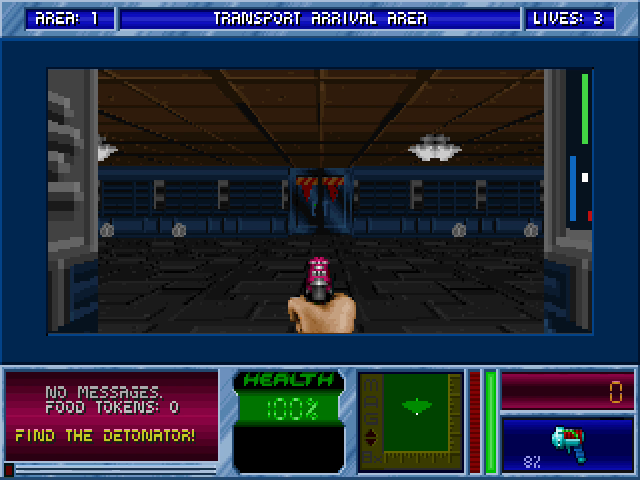 |
| A Sector Patrol guard, Star Institute | A scientist in the Transport Arrival Area |
| 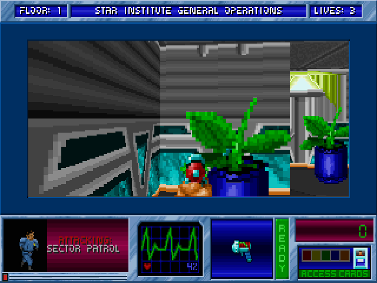 | 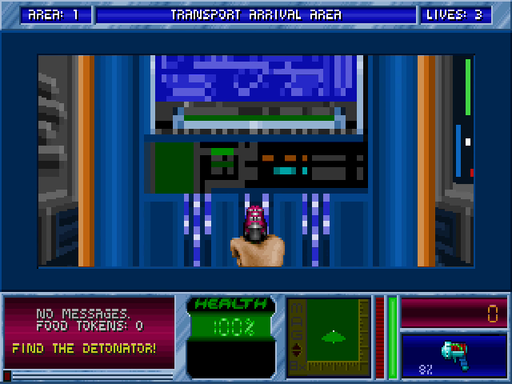 |
| Lit, textured walls: the self-modifying wall scaler, lifted | Planet Strike's tech walls |

## The games

**Blake Stone: Aliens of Gold** puts you in the boots of Blake Stone — Robert
Wills Stone III — an agent of British Intelligence in the year 2140. Dr. Pyrus
Goldfire, a geneticist with no regard for ethics, runs the STAR Institute and is
building an army of human conscripts, modified alien species and
genetically-engineered mutants to take the Earth. Blake works through six
missions — the Star Institute, the Floating Fortress, the Underground Network,
the Star Port, Habitat II and Satellite Defense — each nine floors plus a hidden
one, collecting coloured access cards to reach the next floor. Informants will
slip you information, ammo and food tokens if you don't shoot them; the
Bio-Techs who look just like them will not, and you only find out which is which
by what they say. Sparing the innocent scientists scores higher. The food tokens
buy health from vending machines.
[[Wikipedia]](https://en.wikipedia.org/wiki/Blake_Stone:_Aliens_of_Gold)
[[Classic DOS Games]](https://www.classicdosgames.com/game/Blake_Stone:_Aliens_of_Gold.html)
[[Hardcore Gaming 101]](https://www.hardcoregaming101.net/blake-stone/)

**Blake Stone: Planet Strike** picks up in 2149. Goldfire escaped at the end of
the first game and has surfaced at an abandoned training facility on the planet
Selon, near the old STAR Institute, building "an army stronger than anything
witnessed before." Blake is sent to find and kill him. The access cards are gone:
on each of twenty floors (and four secret ones) you find a fission detonator and
use it on the floor's Security Cube. The automap became a radar that shows a
slice of the level around you.
[[Wikipedia]](https://en.wikipedia.org/wiki/Blake_Stone:_Planet_Strike)

### Where they came from

JAM Productions was **J**im Row **a**nd **M**ike Maynard, with artist Jerry
Jones — all three ex-Softdisk, the same shop the id Software founders had left.
Aliens of Gold ran on the Wolfenstein 3D engine and took about eighteen months.
It added what players had asked Wolfenstein for: an automap, textured ceilings
(added by Apogee's Mark Dochtermann) and floors, distance shading, and a world
that wasn't only enemies. Robert "Bobby" Prince, who scored Wolfenstein 3D, did
the music. [[Wikipedia]](https://en.wikipedia.org/wiki/Blake_Stone:_Aliens_of_Gold)
[[choicest games]](https://www.choicestgames.com/2016/01/where-are-they-now-blake-stone-aliens.html)

Its timing was brutal. The shareware episode came out on **3 December 1993**
and the registered game on the 5th; id released **Doom** a week later, and Doom
"quickly eclipsed Blake Stone, which sold poorly after initial success." The
villain was originally "Dr. Goldstern"; he was renamed Goldfire after a complaint
about the name. Aliens of Gold went through v1.0, v2.0 (February 1994), v2.1
(July 1994, the version recompiled here) and v3.0 (November 1994).
[[Wikipedia]](https://en.wikipedia.org/wiki/Blake_Stone:_Aliens_of_Gold)
[[Classic DOS Games]](https://www.classicdosgames.com/game/Blake_Stone:_Aliens_of_Gold.html)

**Planet Strike** — working title *Blake Stone: Firestorm* — came out on
**28 October 1994**, about two weeks after Doom II, and was JAM's last game.
[[Wikipedia]](https://en.wikipedia.org/wiki/Blake_Stone:_Planet_Strike)
[[Hardcore Gaming 101]](https://www.hardcoregaming101.net/blake-stone/)

In July 2013 Apogee released *Planet Strike*'s source code under the GPL (the game
data stayed commercial). Both games are sold today on Steam (the Apogee Throwback
Pack and the 3D Realms Anthology) and on GOG. Boris Bendovsky's [BStone](https://github.com/bibendovsky/bstone)
is the source port built on that release, with high-resolution rendering, and is
the way to play these games with modern features today.

This project goes the other way and uses none of that code: it starts from the
executables you own — both of them, including *Aliens of Gold*, whose source was
never released — and preserves exactly the machine code JAM shipped.

> Some small things a recompile turns up: the intro flashes a PARENTAL WARNING
> "PC-13 — GRAPHIC VIOLENCE" card before the title; Planet Strike's in-game
> *Story Thus Far* is written as REBA, the agency's computer, opening Blake's file
> ("I will not theorize or, in Blake's words, chatter"); and the high-score table
> in the CONFIG files that ship with the games is the team itself — Jerry Jones,
> Michael Maynard, James T. Row.

## Getting Started

You need your own copy of the games. The Steam *Apogee Throwback Pack* / *3D
Realms Anthology* releases and GOG's work; any DOS install of *Aliens of Gold*
v2.1 or *Planet Strike* V1.01 should too (other versions are untested).

### Quick start

1. Download this repository (Code → Download ZIP) and unzip it anywhere.
2. Double-click **`Setup.cmd`**.

Setup checks for Python 3, CMake, Visual Studio 2022's C++ build tools and Git,
and **asks** before installing any that are missing (it says what, why and how
big). It finds the games in your Steam libraries (or GOG's default folder, or
asks you), copies the game files into `original\`, fetches pcrecomp next to this
folder, lifts and builds both games, and leaves two shortcuts here:
**Blake Stone - Aliens of Gold** and **Blake Stone - Planet Strike**. If anything
fails it stops with one sentence on what to do and writes the details to
`setup.log`; running it again carries on from where it stopped.

### Step by step

Prerequisites: Windows 10/11 x64, Python 3.10+ (`py --version`), CMake 3.20+,
Visual Studio 2022 with the *Desktop development with C++* workload (Build Tools
is enough), Git. ffmpeg is optional (only `--record` needs it).

1. **Get the toolkit**, next to this folder:

   ```powershell
   git clone https://github.com/sp00nznet/pcrecomp ..\pcrecomp
   git -C ..\pcrecomp checkout fc852e3
   $env:PCRECOMP_HOME = (Resolve-Path ..\pcrecomp)
   ```

2. **Copy your game files** into `original\aog` and `original\ps` — the game's
   own folder, not the DOSBox folder Steam wraps it in:

   ```powershell
   $s = "C:\Program Files (x86)\Steam\steamapps\common"   # or your library
   mkdir original\aog, original\ps
   copy "$s\Blake Stone Aliens of Gold\Blake Stone - Aliens of Gold\*.*" original\aog
   copy "$s\Blake Stone Planet Strike\Blake Stone - Planet Strike\*.*" original\ps
   ```

3. **Lift** each executable to C:

   ```
   > py tools\lift.py aog
   BS_AOG.EXE: DGROUP 424B, 39 code segments, 969 functions, 77031 instructions lifted, 262 stored code pointers, 0 extra entries, 74 switch tables
     4 undecodable targets, first: 285F:FFFE (in fn_28624), 2FC8:2E42 (in fn_329D0), 2FC8:25D7 (in fn_31DD2), 0C96:0C9C (in fn_0D5F6)
     32 self-modified code bytes
     1 far calls into nothing (stubbed as dispatch)
     -> G:\recomp\pc\blakestone\work\aog\gen (7 files, 10 changed)
   > py tools\lift.py ps
   BS_FIRE.EXE: DGROUP 4450, 39 code segments, 1003 functions, 74568 instructions lifted, 285 stored code pointers, 0 extra entries, 88 switch tables
     2 undecodable targets, first: 3199:2F42 (in fn_348B1), 3199:25D7 (in fn_33AE2)
     32 self-modified code bytes
     -> G:\recomp\pc\blakestone\work\ps\gen (7 files, 10 changed)
   ```

   The "undecodable targets" are branches in bytes that are never executed
   (data after a call that does not return); they are expected.

4. **Build** (a few minutes; the lifted C is large):

   ```powershell
   cmake -B build -G "Visual Studio 17 2022" -A x64 -DPCRECOMP_HOME=$env:PCRECOMP_HOME
   cmake --build build --config Release -- -m
   ```

   Expect `build\Release\bstone_aog.exe` and `build\Release\bstone_ps.exe`.

5. **Play** from this folder (the games look for `original\<game>` and keep
   CONFIG and saved games in `saves\<game>`):

   ```powershell
   build\Release\bstone_aog.exe
   ```

**Usual trip-ups.** `python` opening the Microsoft Store means the Store alias
is in the way: use `py`, or turn the alias off in *Settings → Apps → Advanced app
settings → App execution aliases*. A tool you just installed is not on `PATH`
until you open a new terminal. `cannot find the pcrecomp toolkit` means
`PCRECOMP_HOME` is unset in this terminal.

## Usage

```
bstone_aog.exe [options] [-- game arguments]
bstone_ps.exe  [options] [-- game arguments]
```

| Option | |
|---|---|
| `--fullscreen` | start fullscreen; **Alt+Enter** toggles |
| `--scale N` | window size in multiples of 320×240 (default 3) |
| `--hires N` | hi-res 3D view at N × 320×200 (default 4 in a window, off headless) |
| `--widescreen A` | widen the hi-res view to aspect `A`: `16:9` (default in a window), `21:9`, or `off` (default headless). **F10** cycles widescreen → original → hi-res 4:3 |
| `--display MODE` | `sharp` (4:3, the default), `pixel` (whole multiples, square pixels) or `crt` (4:3 with scanlines); **F11** cycles them |
| `--mute` | no sound |
| `--data DIR` / `--save DIR` | game files / where CONFIG and saved games go |
| `--headless` | no window and no audio device (works over RDP and in CI); time is deterministic, so runs are reproducible and faster than real time |
| `--realtime` | with `--headless`: run on the wall clock instead |
| `--record out.mp4` | record video and audio (needs ffmpeg) |
| `--seconds N` | quit after N seconds |
| `--keys "ms:KEY,..."` | scripted input, e.g. `--keys "3000:ENTER,9000:ENTER"` |
| `--route "ms;go X,Y;use;..."` | test autopilot: walk the player to waypoints (see [docs/conformance.md](docs/conformance.md)) |
| `--shot-at "ms:file.bmp,..."`, `--shot file.bmp`, `--wav out.wav` | frames and audio for testing |
| `--trace` | log DOS calls and Sound Blaster commands to stderr |

In the window: click to capture the mouse (it is released when the window loses
focus), **F12** saves a screenshot to `screenshots\`, **Alt+F4** quits. An Xbox-style
pad works as the keys the games already use: stick or d-pad to move, **RT** fire,
**LT** strafe, **A** use, **X** Enter, **RB** run, **B**/**Start** Esc, **Back** Tab. The
games' own keys and options are unchanged; turn the mouse on in their
*Controls* menu.

A one-minute video of either game, with no window at all:

```powershell
build\Release\bstone_ps.exe --headless --seconds 60 --record ps.mp4 --keys "3000:ENTER,9000:ENTER,13000:ENTER,15000:ENTER,17000:ENTER,20000:ENTER,22000:ENTER,24000:ENTER,26000:ENTER,28000:ENTER,30000:ENTER,40000:UP+3000"
```

## Building from source

The lifted C is **not** in this repository. It is a machine translation of the
games' own code, so it is not redistributable: you generate it from your copy,
the same way you supply the game data. `original\`, `work\` (the unpacked image
and the lifted C) and `saves\` are all gitignored.

- `tools/lift.py` — the lift driver. Needs pcrecomp (`PCRECOMP_HOME`, or a
  `..\pcrecomp` checkout). Re-run it after changing it or the toolkit.
- `src/` — the DOS machine the lifted code runs on. See
  [docs/architecture.md](docs/architecture.md).
- `py tools\conformance.py` — the conformance harness;
  `build\Release\selftest.exe` — the hardware models without game data.
  See [docs/conformance.md](docs/conformance.md).
- `cmake -B build-dbg -DBSTONE_TRACE=ON` — a debug build with symbolised guest
  call stacks; see [docs/lifting.md](docs/lifting.md#debugging-kit).

**Toolkit version.** This needs pcrecomp changes made for these games — LZEXE
unpacking, Borland's emulator shortcuts, 32-bit index registers, FS/GS decoding
and self-modifying code — pcrecomp #35–#39, all merged. Setup and CI build
against pcrecomp commit `fc852e3`, the one conformance last ran against; any
later `main` should work too. See [CHANGELOG](CHANGELOG.md).

## Documentation

| Page | What is in it |
|------|---------------|
| [architecture](docs/architecture.md) | The parts, memory map, how time and interrupts work |
| [lifting](docs/lifting.md) | Everything that took real time: LZEXE, the 8087 emulator, 386 code, self-modifying code, switch tables, finding functions nothing calls |
| [renderer](docs/renderer.md) | The hi-res 3D view: asking the original raycaster, compositing by who drew each pixel |
| [conformance](docs/conformance.md) | What the harness checks and why that is the ground truth |
| [ROADMAP](ROADMAP.md) | What's next — including the real remaster work |

## License

The code in this repository — the lift driver, the runtime, the scripts and the
documentation — is MIT licensed ([LICENSE](LICENSE)). `third_party/ymfm` is
Aaron Giles' ymfm under the BSD 3-Clause licence ([NOTICE](NOTICE)).

That covers this project's own work and nothing else. **Blake Stone: Aliens of
Gold and Blake Stone: Planet Strike are not included and are not licensed here.**
No game executable, data, art, audio or manual is in this repository, and nothing
generated from either executable is either. The screenshots and the GIF above are
captures of the games running, to show what the project does; the pictures in
them belong to their owners. This project is unaffiliated with JAM Productions,
Apogee Software or 3D Realms, and uses none of the GPL-licensed *Planet Strike*
source release.
